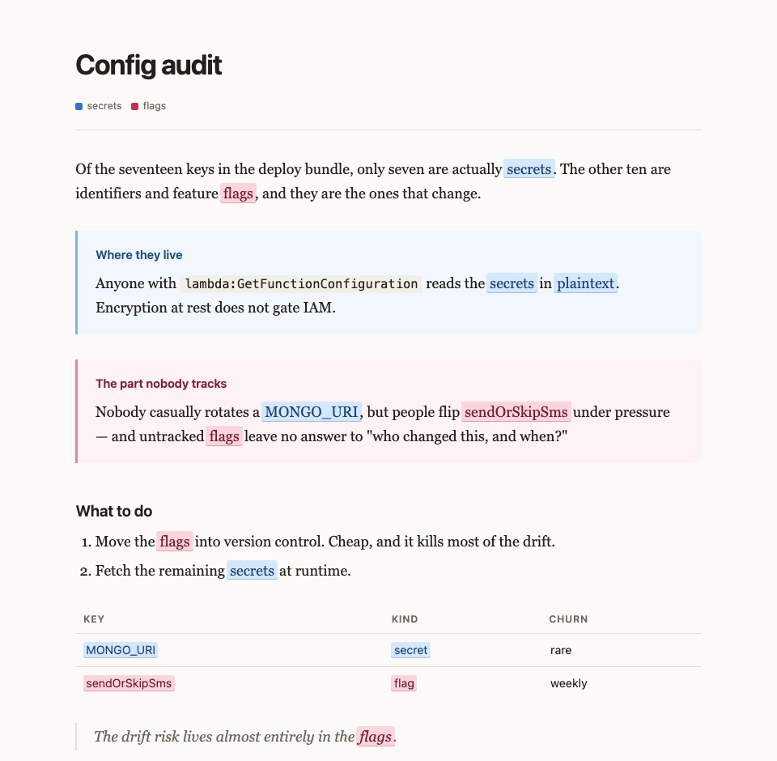

# colorito

Turn a dense agent answer into a styled HTML page — where color tracks **concepts**, not
emphasis.

Long analytical answers arrive as a wall of uniform text. The usual fix is to color
emphasis: red for bad, green for good, bold for important. That decays quickly, because
emphasis is subjective and gets applied differently in every paragraph.

colorito does something narrower and more useful. You declare the two to four ideas a
document is actually about, along with the words that refer to each one:

```
@secrets: secret, secrets, plaintext, credentials, MONGO_URI
@flags:   flag, flags, feature flag, sendOrSkipSms
```

Every mention of those words is then tinted the same hue across the whole page, with no
further markup. The reader learns the mapping once from the legend, and can then trace an
idea through ten paragraphs at a glance — which sections discuss it, where two concepts
collide, which one is really carrying the argument.



## Install

As a skill:

```bash
npx skills add hookdump/colorito@colorito
```

Then ask for it by name — *"make that pretty"* — and a page opens in your browser.

As a plain CLI (not on npm yet, so install from GitHub):

```bash
npx github:hookdump/colorito --demo --open
npx github:hookdump/colorito notes.co --open
echo '@risk: exposure
The exposure is real.' | npx github:hookdump/colorito --open
```

| Flag | Effect |
| --- | --- |
| `--open` | open the rendered page in the default browser |
| `--out <path>` | write here instead of a temp file |
| `--title <text>` | page title (default: the first heading) |
| `--demo` | render a sample document |

The command prints the path it wrote. Output is a single self-contained HTML file — inline
CSS, no scripts, no remote assets — so it works offline and can be mailed as one file.

## Concepts

`@name: word, word` declares one. The name is automatically part of its own vocabulary.
Colors come from a curated palette in declaration order, so you never pick them; pin one
with `@name teal: ...` if you must (`azure`, `rose`, `teal`, `amber`, `violet`, `lime`,
`orange`, `cyan`).

Matching is case-insensitive and whole-word, longest phrase first, so `access key` beats
`key`. Code spans, fenced blocks, headings and URLs are never highlighted — tinting an
identifier inside code is noise.

Wrap a passage that's wholly about one concept and it gets a tinted background and a colored
edge in the same hue:

```
:::secrets Where they actually live
Anyone with `lambda:GetFunctionConfiguration` reads them in plaintext.
:::
```

An undeclared name renders as a neutral card. Everything else is ordinary markdown:
headings, nested lists, bold, italic, code, strikethrough, blockquotes, rules, pipe tables,
fenced blocks, links. The first `#` heading becomes the page title.

## On restraint

The skill spends more words on choosing concepts than on syntax, deliberately. Concepts are
the recurring *nouns* a document is about — systems, actors, forces in tension — not
"important" and "warning". Two to four, never more. Each must recur across paragraphs to
earn a hue. Avoid vocabulary so common it hits every other line (`data`, `code`, `system`),
because highlighting that appears constantly reads as decoration.

A page where most words are tinted reads exactly like a page where none are.

## Limitations

- Opens a local file, so it's a per-machine artifact, not a link you can share.
- Vocabulary is literal: plurals and inflections need listing when they differ.
- Whole-word matching uses `\b`-style lookarounds, so hyphenated forms need their own entry.
- No syntax highlighting inside fenced blocks.

## Development

```bash
npm test        # 26 subprocess tests, no dependencies
npm run demo
```

## History

v1 rendered to ANSI for the terminal. It worked, and it was undeliverable: Claude Code
collapses command output to "Ran 1 shell command", so the colors reached the model and never
the user, and there's no TTY to write to directly. The browser is a channel that actually
arrives. That story is in the git history.

## License

MIT
